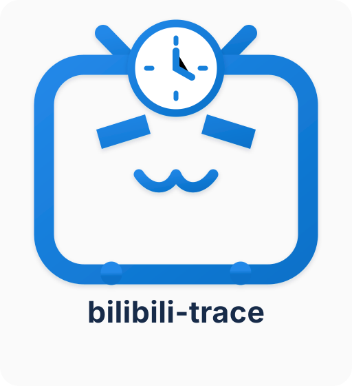

<p align="center">
  
</p>

<h1 align="center">Trace — 个人数字行为分析器</h1>

<p align="center">
  Android-first · Local-first · Privacy-first
</p>

Trace 是一款 Android 优先、隐私优先的个人内容消费行为分析工具。首个数据源为哔哩哔哩（Bilibili），关注时间管理、行为分析和学习复盘。

> 产品边界：Trace 不复制 B 站已有的历史记录、收藏或关注管理。它关注跨时间的行为轨迹、时间分配、兴趣变化，以及“看完之后做了什么”。

## 项目图标

项目 Logo 源文件：[`docs/assets/bilibili-trace-logo.svg`](docs/assets/bilibili-trace-logo.svg)。Android 启动器使用匹配的自适应矢量图标。

## Repository status

当前仓库包含产品/工程文档和 Android 初始工程骨架。**初始页面不代表采集功能已实现**；UsageStats、内容识别、Room 持久化和分析功能将按路线图分阶段实现，并以测试结果为准。

## Start here

1. Read [AGENTS.md](AGENTS.md) before asking an AI coding agent to change code.
2. Read [PRD](docs/PRD.md), [architecture](docs/ARCHITECTURE.md), [data model](docs/DATA_MODEL.md), [collection and privacy](docs/ANDROID_DATA_COLLECTION.md), [analytics](docs/ANALYTICS.md), and [roadmap](docs/ROADMAP.md).
3. Follow [development workflow](docs/DEVELOPMENT_WORKFLOW.md) and [quality gates](docs/QUALITY_GATES.md).
4. Open the `app/` project in Android Studio, or use the Gradle commands documented below.

## Initial Android stack

- Kotlin
- Jetpack Compose + Material 3
- Android Gradle Plugin and Gradle versions pinned in build files / version catalog
- JUnit for local unit tests
- GitHub Actions for build, lint, and unit-test checks

The app is intentionally local-first. No backend, account system, remote AI, telemetry, or platform credentials are required for the initial skeleton.

## Build and test

The CI workflow provisions JDK and Android SDK and runs Gradle tasks. For local development, use Android Studio's Gradle sync and run configuration. If using a local Gradle installation, run:

```powershell
gradle testDebugUnitTest
gradle lintDebug
gradle assembleDebug
```

A Gradle Wrapper should be added and verified as part of the first local Android Studio bootstrap; do not generate or commit an unverified wrapper binary. Once the wrapper is present, prefer `./gradlew` (Windows: `gradlew.bat`) over a globally installed Gradle.

## Privacy and data semantics

- App foreground time is not the same as actual video watch time.
- Accessibility-based content recognition is optional and must be separately disclosed and enabled.
- Personal behavior data stays local by default.
- Never commit secrets, cookies, credentials, real user behavior logs, or screenshots containing personal data.

## Documentation

- [PRD](docs/PRD.md)
- [Architecture](docs/ARCHITECTURE.md)
- [Data model](docs/DATA_MODEL.md)
- [Android data collection and privacy](docs/ANDROID_DATA_COLLECTION.md)
- [Analytics definitions](docs/ANALYTICS.md)
- [MVP validation](docs/MVP_VALIDATION.md)
- [Roadmap](docs/ROADMAP.md)
- [Development workflow](docs/DEVELOPMENT_WORKFLOW.md)
- [Quality gates](docs/QUALITY_GATES.md)
- [Agent engineering contract](AGENTS.md)
